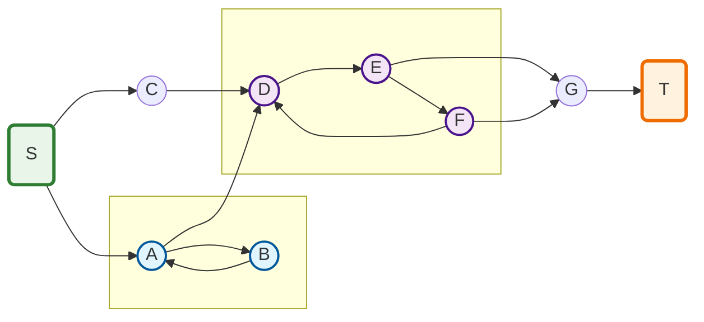
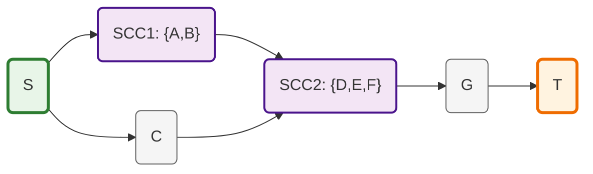

# Kernel & SSR digraphs

## Source–Sink Reachable Graphs (SSR)

Un grafo dirigido $G=(V,E)$ es **Source–Sink Reachable** si:

* Existe al menos un **source** (vértice con indegree 0).
* Existe al menos un **sink** (vértice con outdegree 0).
* Para **todo vértice (v)**:

  * existe un camino desde algún source hasta (v), y
  * existe un camino desde (v) hasta algún sink.

Equivalente en el análisis Input-Ouput $I-A$ es no singular y $(I-A)^{-1} \ge 0$
cuando $A$ es la matriz de adyacencia ponderada (coeficientes técnicos o de distribución)

---

## 2. Definición del Kernel Graph

Sea $G=(V,E)$ dirigido. Definimos una relación de equivalencia:

$$
u \sim v \iff
\begin{cases}
u \leadsto v \\
v \leadsto u
\end{cases}
$$

Es decir: **mutua alcanzabilidad**.

Las clases de equivalencia inducidas son las **componentes fuertemente conexas (SCCs)**.

### 👉 Kernel Graph (o Condensation Graph)

El **Kernel Graph** $G_K = (V_K, E_K)$ se define como:

* $V_K$: el conjunto de SCCs de $G$
* Existe una arista dirigida
  $$
  C_i \to C_j \quad (i \neq j)
  $$
  si existe al menos una arista $(u \to v)$ en $G$ con:
  $$
  u \in C_i,\quad v \in C_j
  $$

📌 En teoría de grafos estándar también se llama:

* **condensation graph**
* **quotient graph by SCCs**

---

## 3. Propiedades fundamentales del Kernel Graph

### (P1) Es un DAG

El Kernel Graph **no tiene ciclos dirigidos**.

> Si hubiera un ciclo entre SCCs, entonces todas formarían una SCC mayor.

---

### (P2) Preserva la estructura Source–Sink

Si (G) es **SSR**, entonces el Kernel Graph (G_K):

* Tiene **al menos un source SCC**
* Tiene **al menos un sink SCC**
* Para toda SCC (C):

  * existe un camino desde algún source SCC hasta (C)
  * existe un camino desde (C) hasta algún sink SCC

Es decir:
If  $G$ es SSR $\Rightarrow $G_K$ es SSR

---

### (P3) Estructura triangular de la matriz

Ordenando las SCCs topológicamente, la matriz de adyacencia queda:

$$
A \sim
\begin{pmatrix}
A_{11} & A_{12} & \cdots & A_{1k} \\
0      & A_{22} & \cdots & A_{2k} \\
\vdots & 0      & \ddots & \vdots \\
0      & \cdots & 0      & A_{kk}
\end{pmatrix}
$$

* Cada bloque $A_{ii}$ es **irreducible**
* El Kernel Graph es el patrón de ceros/no-ceros entre bloques

Esto es clave para:

* M-matrices
* positividad de $(I-A)^{-1}$
* interpretación económica (subsistemas acoplados en cascada)

---

### (P4) Propiedad espectral

Sea $A$ la matriz de adyacencia ponderada.

Entonces: $\rho(A) = \max_i \rho(A_{ii})$

El Kernel Graph permite **localizar** qué SCC controla el radio espectral.

---

### (P5) Interpretación como “esqueleto causal”

El Kernel Graph es el **esqueleto causal mínimo** del sistema:

* Cada nodo = subsistema internamente realimentado
* Las aristas = dependencias irreversibles entre subsistemas
* No hay feedback global, solo local (dentro de SCCs)

En input–output o exergía:

* los ciclos internos representan reciclaje
* el Kernel Graph representa la cadena de transformación neta

## 4. Definición compacta (lista para un paper)

> **Definition (Kernel Graph).**
> Let $G=(V,E)$ be a directed graph. The Kernel Graph $G_K$ is the directed acyclic graph obtained by contracting each strongly connected component of $G$ into a single vertex, with edges induced by the original adjacency relation.
> If (G) is Source–Sink Reachable, then $G_K$ is a Source–Sink Reachable DAG.

[condensated graph](https://cp-algorithms.com/graph/strongly-connected-components.html)

---

>**Proposición**
> Sea $G$ un **DAG finito** y sea (A) su **matriz de adyacencia** (ponderada o no).
Entonces $\rho(A)=0$

*Proof:*

1. Como $G$ es un DAG, existe un **orden topológico** de los vértices.
2. En ese orden, la matriz de adyacencia es **estrictamente triangular superior**:
   $$
   A =
   \begin{pmatrix}
   0 & * & * & \cdots & * \\
   0 & 0 & * & \cdots & * \\
   \vdots & \vdots & \ddots & \ddots & \vdots \\
   0 & 0 & \cdots & 0 & * \\
   0 & 0 & \cdots & 0 & 0
   \end{pmatrix}
   $$
3. Toda matriz estrictamente triangular es **nilpotente**:
   $ \exist k\in V$, such that $A^k = 0$
4. Por tanto, todos los autovalores de (A) son cero, y en consecuencia: $\rho(A)=0$

✔ Independiente de los pesos
✔ Válido para cualquier DAG finito

---

## Corolario útil

Si $G$ es un DAG, entonces:
$$
(I-A)^{-1} = I + A + A^2 + \cdots + A^{k-1}
$$
(con suma finita).

Interpretación:

* no hay realimentación
* no hay amplificación espectral
* solo propagación causal finita

## Conexión con SSR y Kernel Graph

Si $G$ es SSR y $G_K$ es su **Kernel Graph** (Condensated Graph):

* $G_K$ es un DAG
* su matriz de adyacencia tiene radio espectral cero
* todo el “riesgo espectral” está en los bloques SCC

> The adjacency matrix of a finite directed acyclic graph is nilpotent and therefore has spectral radius zero.

## Kernel or Condensated Graph calculation

Premisas:

* $G=(V,E)$ dirigido, finito
* Dispones de la **matriz de alcanzabilidad** o cerramiento transitivo
  $$
  R \in \{0,1\}^{n\times n}
  $$
  donde
  $R_{ij}=1$ if $i \leadsto j$
  (resultado del algoritmo de Warshall / Floyd–Warshall booleano)
* Incluye la reflexividad: $R_{ii}=1$

---

## 1. Paso clave: extraer las SCCs desde (R)

Dos nodos (i,j) están en la **misma componente fuertemente conexa** si y solo si:

$$
\boxed{
i \sim j \iff R_{ij}=1 ;\land; R_{ji}=1
}
$$

Define la matriz: $S = R \land R^\top$

* $S_{ij}=1 \iff i \leadsto j$ $i$ son mutuamente alcanzables $j$
* $S$ es la matriz de una **relación de equivalencia**

### Construcción práctica de las SCCs

* Cada **clase de equivalencia** de (S) es una SCC
* Se puede obtener por:

  * búsqueda de componentes conexas en el grafo no dirigido inducido por $S$
  * o unión–búsqueda (Union–Find)

```matlab
    n=obj.NrOfNodes;
    res=zeros(1,n); cnt=0;
    % Find the strongly connected components
    for u=1:n
      if ~res(u)
        cnt=cnt+1;
        idx = obj.tc(u,:) & obj.tc(:,u)';  
        res(idx)=cnt;
      end
    end
```

---

## 2. Construcción del grafo de condensación

Sea:

* $V_C=\{C_1,\dots,C_k\}$ el conjunto de SCCs
* $E_C=\{(C_p,C_q) : \exists i\in C_p,\; \exists j \in C_q,\;R_{ij}=1 \}$

Sea $R$ la matriz de adjacencia del cerramiento transitivo de un grafo y $M (n \times k)$ la matriz de pertenencia de cada nodo a su componente fuertemente conectada: $M_{ij}=1 \iff i\in C_j$

Entonces la matriz de adyacencia del grafo de condensación se puede obtener como:
$$
A_k = \operatorname{logical} \bigl( M^\top R \; M \bigr) - I_k
$$

Esta matriz cumple:

* $A_K$ es **estrictamente triangularizable**
* No hay ciclos: $\exists m : A_k^m = 0$
* Las fuentes y sumideros del DAG corresponden a:

  * SCCs sin predecesores
  * SCCs sin sucesores

### Algoritmo

**Entrada:**

* `R`: Matriz de adyacencia del cerramiento transitivo $(n \times n)$
* `M`: Matriz de pertenencia SCC (n×k), donde `M(i,j) = 1` si el nodo `i` pertenece a la SCC `j`

**Salida:**

* `A_R` Matriz de adjacencia del grafo de condensación $(k \times k)$

```matlab
function A_K = buildCondensationCompact(R, M)
  % One-liner approach using matrix multiplication
  k = size(M, 2);
  temp = M' * R * M > 0;  % Condensed connectivity
  A_K = temp - eye(k);    % Remove diagonal (no self-loops)
end
```

## 3. Resumen

> Given the transitive closure of a directed graph, the condensation graph can be constructed by identifying equivalence classes under mutual reachability and inducing a DAG on these classes via strict reachability.

## 4. Ejemplo visual: Grafo SSR con SCCs



**Componentes del ejemplo:**

- **Source**: Nodo S (indegree = 0)
- **Sink**: Nodo T (outdegree = 0)
- **SCC₁**: {A, B} - ciclo simple
- **SCC₂**: {D, E, F} - ciclo triangular  
- **Nodos simples**: {S, C, G, T} - cada uno forma su propia SCC

**Verificación SSR:**

- ✅ Desde S se alcanza todo vértice
- ✅ Desde todo vértice se alcanza T
- ✅ Existe source (S) y sink (T)

**Kernel Graph resultante:**



### Matriz de Incidencia en MATLAB

Para el grafo del ejemplo anterior, definimos los nodos numerados como:
- S(1), A(2), B(3), C(4), D(5), E(6), F(7), G(8), T(9)

La **matriz de adyacencia** A en MATLAB sería:

```matlab
% Matriz de adyacencia del grafo SSR ejemplo
% Nodos: S(1), A(2), B(3), C(4), D(5), E(6), F(7), G(8), T(9)
A = [
  0 1 0 1 0 0 0 0 0;  % S -> A, C
  0 0 1 0 1 0 0 0 0;  % A -> B, D  
  0 1 0 0 0 0 0 0 0;  % B -> A
  0 0 0 0 1 0 0 0 0;  % C -> D
  0 0 0 0 0 1 0 0 0;  % D -> E
  0 0 0 0 0 0 1 0 0;  % E -> F
  0 0 0 0 1 0 0 1 0;  % F -> D, G
  0 0 0 0 0 0 0 0 1;  % G -> T
  0 0 0 0 0 0 0 0 0;  % T (sink)
];

% Verificación: radio espectral > 0 debido a los ciclos
rho = max(real(eig(A)));
fprintf('Radio espectral ρ(A) = %.4f\n', rho);

% Labels para los nodos
nodeLabels = {'S', 'A', 'B', 'C', 'D', 'E', 'F', 'G', 'T'};
```

Esta matriz captura:
- **Ciclo SCC₁**: A(2) ↔ B(3) 
- **Ciclo SCC₂**: D(5) → E(6) → F(7) → D(5)
- **Estructura DAG** entre SCCs: S → {A,B,C} → {D,E,F} → G → T

