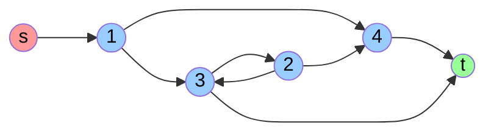

# Example of SSR Digraph and M-Matrix

The following example represents and input-output model, given by the following directed graph and its adjacency table weights.



The digraph is *Source-Sink Reachable* (SSR) and the adjacency table with weights is:

|       |       1 |      2 |      3 |      4 |      t |
|-------|--------:|-------:|-------:|-------:|-------:|
| **s** |  36.620 |  0.000 |  0.000 |  0.000 |  0.000 |
| **1** |   0.000 |  0.000 | 15.147 |  7.737 |  0.000 |
| **2** |   0.000 |  0.000 |  6.136 |  3.135 |  0.000 |
| **3** |   0.000 | 10.225 |  0.000 |  0.000 | 10.000 |
| **4** |   0.000 |  0.000 |  0.000 |  0.000 |  7.168 |

The matrix $A (4 \times 4)$ shows below contains the distribution ratios of the internal proceses from the previous productive graph. The graph is SSR and therefore, this matrix is WCDD.
$$ A =
\begin{bmatrix}
0 & 0 & 0.6619 & 0.3381\\
0 & 0 & 0.6619 & 0.3381\\
0 & 0.5056 & 0 & 0 \\
0 & 0 & 0 & 0\\
\end{bmatrix}
$$

The matrix $I-A$ is a non-singular M-matrix and $\rho(A)=0.5785$

$$ L \equiv (I-A)^{-1} =
\begin{bmatrix}
    1.0000  &  0.5029 &  0.9948  &  0.5081\\
         0  &  1.5029 &  0.9948  &  0.5081\\
         0  &  0.7598 &  1.5029  &  0.2569\\
         0  &       0 &       0  &  1.0000
\end{bmatrix}
$$

The resources consumed by each process i.e. its cost could be calculated as $z=v L$ where $v$ are the resources entering the system,

```matlab
v=[36.2 0 0 0];
L=inv(eye(4)-A);
z=v*L

z =
   36.2000   18.2057   36.0108   18.3949
```

The distribution matrix **A** has elements:
$$a_{ij} = \frac{e_{ij}}{x_i}$$

And the resource consumption vector is calculated as:
$$\mathbf{z} = \mathbf{v}(I-A)^{-1}$$

where $\mathbf{v} = [v_1, v_2, \ldots, v_n]$ and $\mathbf{z} = [z_1, z_2, \ldots, z_n]$ represents the total resource requirements for each process.

## General Input-Output Table Structure

The general input-output table for a system with n processes has the following structure:

|         | **1**     | **...**  | **j**     | **...**  | **n**     | **T**    |
|---------|-----------|----------|-----------|----------|-----------|----------|
| **S**   | $v_1$     | $\cdots$ | $v_i$     | $\cdots$ | $v_n$     | $0$      |
| **1**   | $e_{1,1}$ | $\cdots$ | $e_{1,j}$ | $\cdots$ | $e_{1,n}$ | $w_1$    |
| **...** | $\vdots$  | $\ddots$ | $\vdots$  | $\ddots$ | $\vdots$  | $\vdots$ |
| **i**   | $e_{i,1}$ | $\ddots$ | $e_{i,j}$ | $\ddots$ | $e_{i,n}$ | $w_i$    |
| **...** | $\vdots$  | $\ddots$ | $\vdots$  | $\ddots$ | $\vdots$  | $\vdots$ |
| **n**   | $e_{n,1}$ | $\cdots$ | $e_{n,j}$ | $\cdots$ | $e_{n,n}$ | $w_n$    |

Where:

- $v_i$ are the external resource inputs to process $i$
- $e_{i,j}$ are the internal flows from process $i$ to process $j$
- $w_i$ are the final outputs from process $i$
- $e_{i,i} = 0$ (no self-loops in the internal flows)

The total output from each process $i$ is:
$$x_i = w_i+\sum_{j=1}^{n} e_{i,j}\quad i=1,\dots,n$$

The technical coeficient matrix $A=(\alpha_{ij})$ is defined as:
$$\alpha_{i,j} = \frac{e_{i,j}}{x_j}\quad i,j=1,\dots,n$$

And the distribution matrix $B=(\beta_{ij})$ elements are:
$$\beta_{i,j} = \frac{e_{i,j}}{x_i}$$

## SSR Digraphs and Non-singular M-Matrices

>**Theorem**: If the directed graph associated with an input-output model is Source-Sink Reachable (SSR), then both $I-A$ and $I-B$ are non-singular M-matrices, where $A$ is the technical coefficient matrix and $B$ is the distribution matrix.

*Proof:*

Since the graph is SSR, every internal process $i$ must:

- Be reachable from at least one source $s \in S$
- Have a path to at least one sink $t \in T$

This implies that for the distribution matrix $B$;

1. **Non-negativity**: $B \geq 0$ since $e_{ij} \geq 0$ and $x_i > 0$
2. **Row stochastic constraint**: Each row satisfies $\sum_{j=1}^n \beta_{ij} \leq 1$ because:
    $$\sum_{j=1}^n \beta_{ij} = \sum_{j=1}^n \frac{e_{ij}}{x_i} = \frac{1}{x_i}\sum_{j=1}^n e_{ij} \leq  1$$

The SSR property ensures that $I-B$ is Weakly Chained Diagonally Dominant (WCDD):

- **Strict diagonal dominance for some rows**: Processes that send output to sinks have $\sum_{j=1}^n \beta_{ij} < 1$ because part of their output $w_i > 0$ goes to final demand
- **Connectivity condition**: For any process $i$ without strict diagonal dominance, the SSR property guarantees a path to a process with strict diagonal dominance

Let $J = \{i : \sum_{j=1}^n \beta_{ij} < 1\}$ be the set of processes with strict row diagonal dominance.

For any $i_0 \notin J$, since the graph is SSR, there exists a path $i_0 \rightarrow i_1 \rightarrow \cdots \rightarrow i_r \rightarrow t$ where:

- Each edge corresponds to $\beta_{i_{k-1},i_k} > 0$
- Process $i_r$ must have output to sink $t$, so $i_r \in J$

By the WCDD theorem, since $I-B$ is weakly chained diagonally dominant, it is non-singular.
Since $B \geq 0$ and $I-B$ is non-singular with spectral radius $\rho(B) < 1$, we have:

- $(I-B)^{-1} = \sum_{k=0}^{\infty} B^k \geq 0$ (Neumann series)
- $I-B$ has the canonical M-matrix form with \rho(B)<1$

Therefore, $I-B$ is a non-singular M-matrix.

For the technical coefficient matrix $A$, we can establish the relationship:

$$e_{ij} = \alpha_{ij} x_j = \beta_{ij} x_i$$

Then $A$ and $B^T$ are similar matrices:
$$A = \hat{x}^{-1} B^T \hat{x}$$

Since similar matrices have identical spectral radii: $\rho(A) = \rho(B^T) = \rho(B) < 1$

Therefore, $I-A$ is a non-singular M-matrix.

### Conclusion

The SSR property of the productive digraph ensures both $I-A$ and $I-B$ satisfy the non-singular M-Matrix conditions, This guarantees the economic feasibility and stability of the input-output system, with well-defined solutions for both forward and backward linkage analyses.
