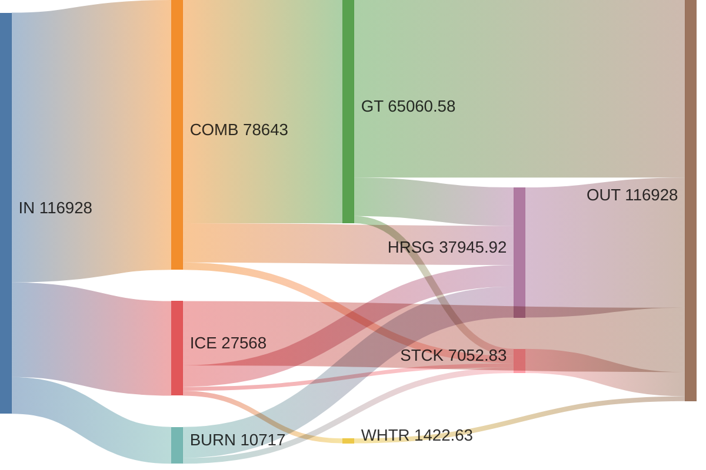

# TaesLab

Thermoeconomic Analysis of Energy Systems for MATLAB

A comprehensive MATLAB toolbox for thermoeconomic analysis and diagnosis of industrial energy systems using exergy-based methods. [see Description](#description)

## Table of Contents

- Description
- Installation
- Usage
- Features
- Configuration
- Documentation
- Examples
- License

## Description

TaesLab is an object-oriented MATLAB toolbox designed for advanced thermoeconomic analysis of industrial energy systems. It provides a complete framework for:

- **Exergy Analysis**: Flow-process exergy calculations, irreversibilities, and efficiency evaluation
- **Thermoeconomic Analysis**: Cost allocation using exergy-based methods
- **System Diagnosis**: Comparative analysis for malfunction detection and performance optimization
- **Multi-format Data Support**: JSON, XML, XLSX, CSV, and MAT file compatibility

The toolbox follows strict object-oriented design patterns with comprehensive validation, making it suitable for both research and industrial applications.

## Installation

### Prerequisites

- **MATLAB** R2019b or later (recommended)
- **GNU Octave** 6.0+ (alternative, with limited GUI support)

### Setup

1. **Clone the repository:**

   ```bash
   git clone https://github.com/your-username/TaesLab.git
   cd TaesLab
   ```

2. **Add to MATLAB path:**

   ```matlab
   % In MATLAB command window
   addpath(genpath('path/to/TaesLab'));
   savepath;
   ```

3. **Verify installation:**

   ```matlab
   % Test with example model
   model = ThermoeconomicModel('Examples/rankine/rankine_model.json');
   if isValid(model)
       fprintf('TaesLab installed successfully!\n');
   end
   ```

## Usage

### Quick Start

````matlab
% 1. Load a data model
data = ReadDataModel('Examples/rankine/rankine_model.json');

% 2. Create thermoeconomic model
model = ThermoeconomicModel(data);

% 3. Run analysis
results = model.thermoeconomicAnalysis();

% 4. Display results
ShowResults(results, 'Table', 'dcost');
````

### GUI Applications

**TaesApp** - Full-featured MATLAB App Designer interface:

```matlab
TaesApp  % Launch main application

```

**TaesTool** - Command-line compatible interface:

```matlab
TaesTool  % Cross-platform tool (MATLAB/Octave)
```

### Analysis Workflow

````matlab
% Complete analysis pipeline
data = ReadDataModel('plant_model.json', 'Debug', true);
model = ThermoeconomicModel(data, 'CostTables', 'ALL');

% Individual analyses
structure = model.productiveStructure();
exergy = model.exergyAnalysis();
costs = model.thermoeconomicAnalysis();
diagnosis = model.diagnosisAnalysis('reference', 'design');

% Export results
SaveResults(costs, 'thermoeconomic_results.xlsx');
````

## Features

### Core Capabilities

- **🔬 Exergy Analysis**: Comprehensive exergy balance and efficiency calculations
- **💰 Cost Analysis**: Direct and indirect cost allocation using exergy methods  
- **🔍 System Diagnosis**: Multi-state comparison and malfunction detection
- **📊 Multiple Data Formats**: JSON, XML, XLSX, CSV, MAT file support
- **📈 Advanced Visualization**: Interactive tables and graphs
- **🔄 Batch Processing**: Multi-state and multi-sample analysis

### Technical Features

- **Object-Oriented Architecture**: Clean inheritance hierarchy with validation
- **Cross-Platform**: MATLAB and GNU Octave compatibility
- **Extensible Design**: Plugin architecture for custom analysis modules
- **Data Validation**: Comprehensive input validation and error handling
- **Results Management**: Organized table system with export capabilities

### Supported Analysis Types

| Analysis | Description | Output |
|----------|-------------|---------|
| **Productive Structure** | Flow-process relationships and system topology | Adjacency matrices, structure tables |
| **Exergy Analysis** | Exergy balances, irreversibilities, efficiencies | Flow exergies, process performance |
| **Thermoeconomic Analysis** | Cost allocation and economic evaluation | Unit costs, cost flows |
| **Diagnosis Analysis** | Comparative analysis for fault detection | Malfunction matrices, anomaly detection |
| **Waste Analysis** | Waste cost optimization and recycling | Waste cost allocation strategies |

## Configuration

### Data Model Structure

TaesLab uses standardized data models with the following sections:

````json
{
  "ProductiveStructure": {
    "flows": [
      {"key": "CMB", "type": "RESOURCE"},
      {"key": "WN", "type": "OUTPUT"}
    ],
    "processes": [
      {"key": "BOIL", "fuel": "CMB", "product": "B1+B2"}
    ]
  },
  "ExergyStates": {
    "design": {
      "CMB": {"exergy": 1000.0, "units": "kW"},
      "WN": {"exergy": 250.0, "units": "kW"}
    }
  }
}
````

### Naming Conventions

- **Flow Keys**: Must match `^[A-Z][A-Za-z0-9]{1,7}$` (e.g., `CMB`, `B1`, `QC`)
- **Process Keys**: Must match `^[A-Z][A-Za-z0-9]{1,7}$` (e.g., `BOIL`, `TURB`)
- **State Names**: Must match `^[A-Za-z]\w{1,9}$` (e.g., `design`, `off_design`)

### File Format Support

| Format | Reader Class | Use Case |
|--------|--------------|----------|
| **JSON** | `cReadModelJSON` | Structured data models |
| **XML** | `cReadModelXML` | Legacy system integration |
| **XLSX** | `cReadModelXLS` | Excel-based workflows |
| **CSV** | `cReadModelCSV` | Tabular data import |
| **MAT** | Native MATLAB | Binary data storage |

## Documentation

### Class Architecture

```matlab
cTaesLab (base)
├── cMessageLogger
│   ├── cDataModel (data warehouse)
│   └── cThermoeconomicModel (analysis engine)
├── cResultId (computation)
│   ├── cExergyModel
│   ├── cExergyCost
│   └── cDiagnosis
└── cTable (presentation)
    ├── cTableData
    ├── cTableCell
    └── cTableMatrix
```

### Key Functions

- `ReadDataModel()` - Universal file reader with format detection
- `ThermoeconomicModel()` - Main analysis class constructor
- `ShowResults()` - Unified results display
- `SaveResults()` - Export results to various formats
- `isValid()` - Object validation utility

## Examples

The [`Examples`](Examples ) directory contains complete plant models:

- **`rankine/`** - Steam Rankine cycle (canonical test case)
- **`brayton/`** - Gas turbine cycle
- **`combined/`** - Combined cycle power plant
- **`industrial/`** - Industrial process examples

Each example includes:

- Data model files (JSON, XLSX)
- Analysis scripts
- Expected results
- Documentation

**Cost Diagram Example**



## License

This project is licensed under the MIT License - see the [`LICENSE`](LICENSE ) file for details.

---

**Repository**: [https://github.com/ctorrescuadra/TaesLab](https://github.com/ctorrescuadra/TaesLab)  
**Documentation**: [Wiki Pages](https://github.com/ctorrescuadra/TaesLab/wiki)  
**Issues**: [Bug Reports & Feature Requests](https://github.com/your-username/TaesLab/issues)